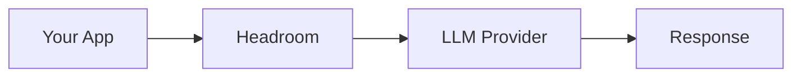
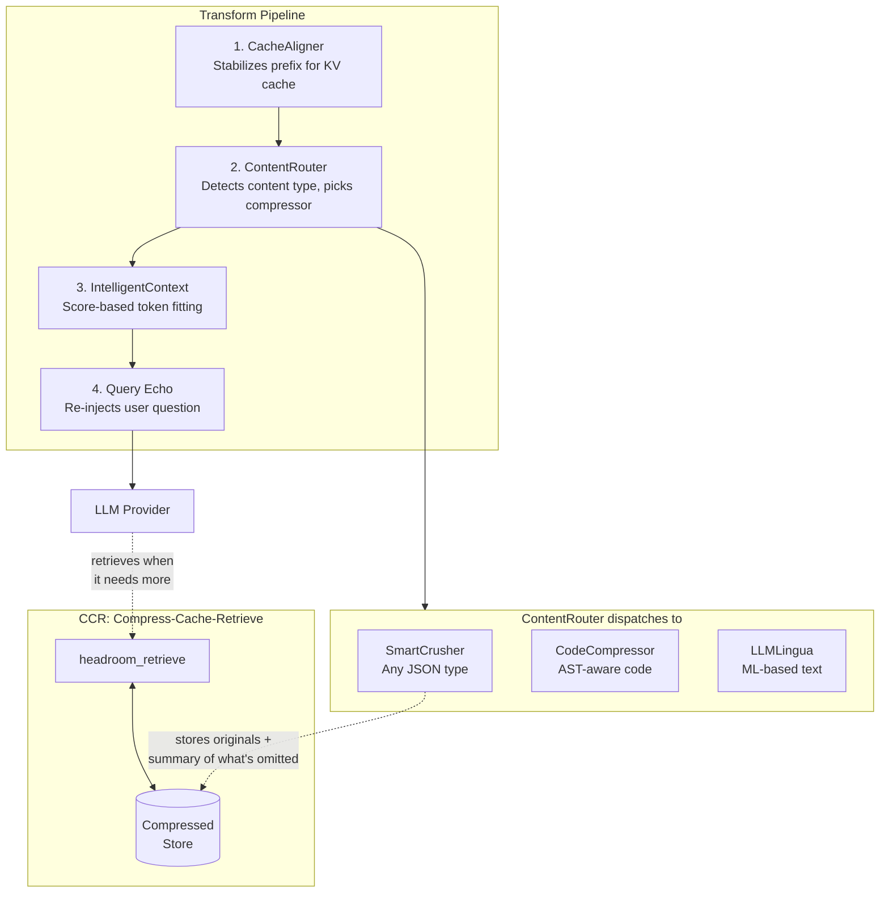

<p align="center">
  <h1 align="center">Headroom</h1>
  <p align="center">
    <strong>The Context Optimization Layer for LLM Applications</strong>
  </p>
  <p align="center">
    Tool outputs are 70-95% redundant boilerplate. Headroom compresses that away.
  </p>
</p>

<p align="center">
  <a href="https://github.com/chopratejas/headroom/actions/workflows/ci.yml">
    
  </a>
  <a href="https://pypi.org/project/headroom-ai/">
    
  </a>
  <a href="https://pypi.org/project/headroom-ai/">
    
  </a>
  <a href="https://pypistats.org/packages/headroom-ai">
    
  </a>
  <a href="https://github.com/chopratejas/headroom/blob/main/LICENSE">
    
  </a>
  <a href="https://chopratejas.github.io/headroom/">
    
  </a>
</p>

---

## Demo

<p align="center">
  
</p>

---

## Quick Start

```bash
pip install "headroom-ai[all]"
```

### Simplest: Proxy (zero code changes)

```bash
headroom proxy --port 8787
```

```bash
# Claude Code — just set the base URL
ANTHROPIC_BASE_URL=http://localhost:8787 claude

# Cursor, Continue, any OpenAI-compatible tool
OPENAI_BASE_URL=http://localhost:8787/v1 cursor
```

Works with any language, any tool, any framework. One env var. **[Proxy docs](docs/proxy.md)**

### Python: One function

```python
from headroom import compress

result = compress(messages, model="claude-sonnet-4-5-20250929")
response = client.messages.create(model="claude-sonnet-4-5-20250929", messages=result.messages)
print(f"Saved {result.tokens_saved} tokens ({result.compression_ratio:.0%})")
```

Works with any Python LLM client — Anthropic, OpenAI, LiteLLM, httpx, anything.

### Already have a proxy or gateway?

You don't need to replace it. Drop Headroom into your existing stack:

| Your setup | Add Headroom | One-liner |
|------------|-------------|-----------|
| **LiteLLM** | Callback | `litellm.callbacks = [HeadroomCallback()]` |
| **Any Python proxy** | ASGI Middleware | `app.add_middleware(CompressionMiddleware)` |
| **Any Python app** | `compress()` | `result = compress(messages, model="gpt-4o")` |
| **Agno agents** | Wrap model | `HeadroomAgnoModel(your_model)` |
| **LangChain** | Wrap model | `HeadroomChatModel(your_llm)` *(experimental)* |

**[Full Integration Guide](docs/integration-guide.md)** — detailed setup for LiteLLM, ASGI middleware, compress(), and every framework.

---

## Does It Actually Work?

**100 production log entries. One critical error buried at position 67.**

|  | Baseline | Headroom |
|--|----------|----------|
| Input tokens | 10,144 | 1,260 |
| Correct answers | **4/4** | **4/4** |

Both responses: *"payment-gateway, error PG-5523, fix: Increase max_connections to 500, 1,847 transactions affected."*

**87.6% fewer tokens. Same answer.** Run it: `python examples/needle_in_haystack_test.py`

<details>
<summary><b>What Headroom kept</b></summary>

From 100 log entries, SmartCrusher kept 6: first 3 (boundary), the FATAL error at position 67 (anomaly detection), and last 2 (recency). The error was automatically preserved — not by keyword matching, but by statistical analysis of field variance.
</details>

### Accuracy Benchmarks

Headroom is evaluated on real OSS benchmarks — compression preserves accuracy.

**Standard Benchmarks** — Baseline (direct to API) vs Headroom (through proxy):

| Benchmark | Category | N | Baseline | Headroom | Delta |
|-----------|----------|---|----------|----------|-------|
| [GSM8K](https://huggingface.co/datasets/openai/gsm8k) | Math | 100 | 0.870 | 0.870 | **0.000** |
| [TruthfulQA](https://huggingface.co/datasets/truthfulqa/truthful_qa) | Factual | 100 | 0.530 | 0.560 | **+0.030** |

**Compression Benchmarks** — Accuracy after compression + CCR (full stack):

| Benchmark | Category | N | Accuracy | Compression | Method |
|-----------|----------|---|----------|-------------|--------|
| [SQuAD v2](https://huggingface.co/datasets/rajpurkar/squad_v2) | QA | 100 | **97%** | 19% | Before/After |
| [BFCL](https://huggingface.co/datasets/gorilla-llm/Berkeley-Function-Calling-Leaderboard) | Tool/Function | 100 | **97%** | 32% | LLM-as-Judge |
| Tool Outputs (built-in) | Agent | 8 | **100%** | 20% | Before/After |
| CCR Needle Retention | Lossless | 50 | **100%** | 77% | Exact Match |

Run it yourself:

```bash
# Quick smoke test (8 cases, ~10s)
python -m headroom.evals quick -n 8 --provider openai --model gpt-4o-mini

# Full Tier 1 suite (~$3, ~15 min)
python -m headroom.evals suite --tier 1 -o eval_results/

# CI mode (exit 1 on regression)
python -m headroom.evals suite --tier 1 --ci
```

Full methodology: [Benchmarks](docs/benchmarks.md) | [Evals Framework](headroom/evals/README.md)

---

## How It Works



### Inside Headroom



> Headroom never throws data away. It compresses aggressively and retrieves precisely.
> When it compresses 500 items to 20, it tells the LLM *what was omitted*
> ("87 passed, 2 failed, 1 error") so the LLM knows when to ask for more.

### Verified on Real Workloads

| Scenario | Before | After | Savings |
|----------|--------|-------|---------|
| Code search (100 results) | 17,765 | 1,408 | **92%** |
| SRE incident debugging | 65,694 | 5,118 | **92%** |
| Codebase exploration | 78,502 | 41,254 | **47%** |
| GitHub issue triage | 54,174 | 14,761 | **73%** |

**Overhead**: 15-200ms compression latency (net positive for Sonnet/Opus). Full data: [Latency Benchmarks](docs/LATENCY_BENCHMARKS.md)

---

## Integrations

| Integration | Status | Docs |
|-------------|--------|------|
| `compress()` — one function | **Stable** | [Integration Guide](docs/integration-guide.md) |
| LiteLLM callback | **Stable** | [Integration Guide](docs/integration-guide.md#litellm) |
| ASGI middleware | **Stable** | [Integration Guide](docs/integration-guide.md#asgi-middleware) |
| Proxy server | **Stable** | [Proxy Docs](docs/proxy.md) |
| Agno | **Stable** | [Agno Guide](docs/agno.md) |
| MCP (Claude Code) | **Stable** | [MCP Guide](docs/mcp.md) |
| Strands | **Stable** | [Strands Guide](docs/strands.md) |
| LangChain | **Experimental** | [LangChain Guide](docs/langchain.md) |

---

## Features

| Feature | What it does |
|---------|-------------|
| **Content Router** | Auto-detects content type, routes to optimal compressor |
| **SmartCrusher** | Universal JSON compression — arrays of dicts, strings, numbers, mixed types, nested objects |
| **CodeCompressor** | AST-aware compression for Python, JS, Go, Rust, Java, C++ |
| **LLMLingua-2** | ML-based 20x text compression |
| **CCR** | Reversible compression — LLM retrieves originals when needed |
| **Compression Summaries** | Tells the LLM what was omitted ("3 errors, 12 failures") |
| **Query Echo** | Re-injects user question after compressed data for better attention |
| **CacheAligner** | Stabilizes prefixes for provider KV cache hits |
| **IntelligentContext** | Score-based context management with learned importance |
| **Image Compression** | 40-90% token reduction via trained ML router |
| **Memory** | Persistent memory across conversations |
| **Compression Hooks** | Customize compression with pre/post hooks |

---

## Cloud Providers

```bash
headroom proxy --backend bedrock --region us-east-1     # AWS Bedrock
headroom proxy --backend vertex_ai --region us-central1 # Google Vertex
headroom proxy --backend azure                          # Azure OpenAI
headroom proxy --backend openrouter                     # OpenRouter (400+ models)
```

---

## Installation

```bash
pip install headroom-ai                # Core library
pip install "headroom-ai[all]"         # Everything including evals (recommended)
pip install "headroom-ai[proxy]"       # Proxy server
pip install "headroom-ai[mcp]"         # MCP for Claude Code
pip install "headroom-ai[agno]"        # Agno integration
pip install "headroom-ai[langchain]"   # LangChain (experimental)
pip install "headroom-ai[evals]"       # Evaluation framework only
```

Python 3.10+

---

## Documentation

| | |
|---|---|
| [Integration Guide](docs/integration-guide.md) | LiteLLM, ASGI, compress(), proxy |
| [Proxy Docs](docs/proxy.md) | Proxy server configuration |
| [Architecture](docs/ARCHITECTURE.md) | How the pipeline works |
| [CCR Guide](docs/ccr.md) | Reversible compression |
| [Benchmarks](docs/benchmarks.md) | Accuracy validation |
| [Latency Benchmarks](docs/LATENCY_BENCHMARKS.md) | Compression overhead & cost-benefit analysis |
| [Limitations](docs/LIMITATIONS.md) | When compression helps, when it doesn't |
| [Evals Framework](headroom/evals/README.md) | Prove compression preserves accuracy |
| [Memory](docs/memory.md) | Persistent memory |
| [Agno](docs/agno.md) | Agno agent framework |
| [MCP](docs/mcp.md) | Claude Code subscriptions |
| [Configuration](docs/configuration.md) | All options |

---

## Contributing

```bash
git clone https://github.com/chopratejas/headroom.git && cd headroom
pip install -e ".[dev]" && pytest
```

---

## License

Apache License 2.0 — see [LICENSE](LICENSE).
