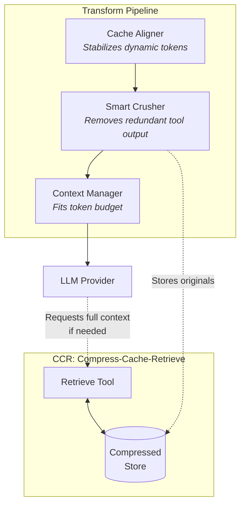

<p align="center">
  <h1 align="center">Headroom</h1>
  <p align="center">
    <strong>The Context Optimization Layer for LLM Applications</strong>
  </p>
  <p align="center">
    Tool outputs are 70-95% redundant boilerplate. Headroom compresses that away.
  </p>
</p>

<p align="center">
  <a href="https://github.com/chopratejas/headroom/actions/workflows/ci.yml">
    
  </a>
  <a href="https://pypi.org/project/headroom-ai/">
    
  </a>
  <a href="https://pypi.org/project/headroom-ai/">
    
  </a>
  <a href="https://pypistats.org/packages/headroom-ai">
    
  </a>
  <a href="https://github.com/chopratejas/headroom/blob/main/LICENSE">
    
  </a>
</p>


---

## Demo

**[Watch Headroom in action](https://github.com/chopratejas/headroom/releases/download/v0.2.15/Headroom.-.Optimized.mp4)** - Analyzing its own codebase with Claude Code while demonstrating real-time token savings with multi-tool agents.

---

## Does It Actually Work? A Real Test

**The setup:** 100 production log entries. One critical error buried at position 67.

<details>
<summary><b>BEFORE:</b> 100 log entries (18,952 chars) - click to expand</summary>

```json
[
  {"timestamp": "2024-12-15T00:00:00Z", "level": "INFO", "service": "api-gateway", "message": "Request processed successfully - latency=50ms", "request_id": "req-000000", "status_code": 200},
  {"timestamp": "2024-12-15T01:01:00Z", "level": "INFO", "service": "user-service", "message": "Request processed successfully - latency=51ms", "request_id": "req-000001", "status_code": 200},
  {"timestamp": "2024-12-15T02:02:00Z", "level": "INFO", "service": "inventory", "message": "Request processed successfully - latency=52ms", "request_id": "req-000002", "status_code": 200},
  // ... 64 more INFO entries ...
  {"timestamp": "2024-12-15T03:47:23Z", "level": "FATAL", "service": "payment-gateway", "message": "Connection pool exhausted", "error_code": "PG-5523", "resolution": "Increase max_connections to 500 in config/database.yml", "affected_transactions": 1847},
  // ... 32 more INFO entries ...
]
```
</details>

**AFTER:** Headroom compresses to 6 entries (1,155 chars):

```json
[
  {"timestamp": "2024-12-15T00:00:00Z", "level": "INFO", "service": "api-gateway", ...},
  {"timestamp": "2024-12-15T01:01:00Z", "level": "INFO", "service": "user-service", ...},
  {"timestamp": "2024-12-15T02:02:00Z", "level": "INFO", "service": "inventory", ...},
  {"timestamp": "2024-12-15T03:47:23Z", "level": "FATAL", "service": "payment-gateway", "error_code": "PG-5523", "resolution": "Increase max_connections to 500 in config/database.yml", "affected_transactions": 1847},
  {"timestamp": "2024-12-15T02:38:00Z", "level": "INFO", "service": "inventory", ...},
  {"timestamp": "2024-12-15T03:39:00Z", "level": "INFO", "service": "auth", ...}
]
```

**What happened:** First 3 items + the FATAL error + last 2 items. The critical error at position 67 was automatically preserved.

---

**The question we asked Claude:** "What caused the outage? What's the error code? What's the fix?"

|  | Baseline | Headroom |
|--|----------|----------|
| Input tokens | 10,144 | 1,260 |
| Correct answers | **4/4** | **4/4** |

Both responses: *"payment-gateway service, error PG-5523, fix: Increase max_connections to 500, 1,847 transactions affected"*

**87.6% fewer tokens. Same answer.**

Run it yourself: `python examples/needle_in_haystack_test.py`

---

## Multi-Tool Agent Test: Real Function Calling

**The setup:** An Agno agent with 4 tools (GitHub Issues, ArXiv Papers, Code Search, Database Logs) investigating a memory leak. Total tool output: 62,323 chars (~15,580 tokens).

```python
from agno.agent import Agent
from agno.models.anthropic import Claude
from headroom.integrations.agno import HeadroomAgnoModel

# Wrap your model - that's it!
base_model = Claude(id="claude-sonnet-4-20250514")
model = HeadroomAgnoModel(wrapped_model=base_model)

agent = Agent(model=model, tools=[search_github, search_arxiv, search_code, query_db])
response = agent.run("Investigate the memory leak and recommend a fix")
```

**Results with Claude Sonnet:**

|  | Baseline | Headroom |
|--|----------|----------|
| Tokens sent to API | 15,662 | 6,100 |
| API requests | 2 | 2 |
| Tool calls | 4 | 4 |
| Duration | 26.5s | 27.0s |

**76.3% fewer tokens. Same comprehensive answer.**

Both found: Issue #42 (memory leak), the `cleanup_worker()` fix, OutOfMemoryError logs (7.8GB/8GB, 847 threads), and relevant research papers.

Run it yourself: `python examples/multi_tool_agent_test.py`

---

## How It Works

> Headroom optimizes LLM context *before* it hits the provider —
> without changing your agent logic or tools.


### Inside Headroom



> Headroom never throws data away.
> It compresses aggressively and retrieves precisely.

### What actually happens

1. **Headroom intercepts context** — Tool outputs, logs, search results, and intermediate agent steps.

2. **Dynamic content is stabilized** — Timestamps, UUIDs, request IDs are normalized so prompts cache cleanly.

3. **Low-signal content is removed** — Repetitive or redundant data is crushed, not truncated.

4. **Original data is preserved** — Full content is stored separately and retrieved *only if the LLM asks*.

5. **Provider caches finally work** — Headroom aligns prompts so OpenAI, Anthropic, and Google caches actually hit.

For deep technical details, see [Architecture Documentation](docs/ARCHITECTURE.md).

---

## Why Headroom?

- **Zero code changes** - works as a transparent proxy
- **47-92% savings** - depends on your workload (tool-heavy = more savings)
- **Reversible compression** - LLM retrieves original data via CCR
- **Content-aware** - code, logs, JSON each handled optimally
- **Provider caching** - automatic prefix optimization for cache hits
- **Framework native** - LangChain, Agno, MCP, agents supported

---

## 30-Second Quickstart

### Option 1: Proxy (Zero Code Changes)

```bash
pip install "headroom-ai[proxy]"
headroom proxy --port 8787
```

Point your tools at the proxy:

```bash
# Claude Code
ANTHROPIC_BASE_URL=http://localhost:8787 claude

# Any OpenAI-compatible client
OPENAI_BASE_URL=http://localhost:8787/v1 cursor
```

### Option 2: LangChain Integration

```bash
pip install "headroom-ai[langchain]"
```

```python
from langchain_openai import ChatOpenAI
from headroom.integrations import HeadroomChatModel

# Wrap your model - that's it!
llm = HeadroomChatModel(ChatOpenAI(model="gpt-4o"))

# Use exactly like before
response = llm.invoke("Hello!")
```

See the full [LangChain Integration Guide](docs/langchain.md) for memory, retrievers, agents, and more.

### Option 3: Agno Integration

```bash
pip install "headroom-ai[agno]"
```

```python
from agno.agent import Agent
from agno.models.openai import OpenAIChat
from headroom.integrations.agno import HeadroomAgnoModel

# Wrap your model - that's it!
model = HeadroomAgnoModel(OpenAIChat(id="gpt-4o"))
agent = Agent(model=model)

# Use exactly like before
response = agent.run("Hello!")

# Check savings
print(f"Tokens saved: {model.total_tokens_saved}")
```

See the full [Agno Integration Guide](docs/agno.md) for hooks, multi-provider support, and more.

---

## Framework Integrations

| Framework | Integration | Docs |
|-----------|-------------|------|
| **LangChain** | `HeadroomChatModel`, memory, retrievers, agents | [Guide](docs/langchain.md) |
| **Agno** | `HeadroomAgnoModel`, hooks, multi-provider | [Guide](docs/agno.md) |
| **MCP** | Tool output compression for Claude | [Guide](docs/ccr.md) |
| **Any OpenAI Client** | Proxy server | [Guide](docs/proxy.md) |

---

## Features

| Feature | Description | Docs |
|---------|-------------|------|
| **Memory** | Persistent memory across conversations (zero-latency inline extraction) | [Memory](docs/memory.md) |
| **Universal Compression** | ML-based content detection + structure-preserving compression | [Compression](docs/compression.md) |
| **SmartCrusher** | Compresses JSON tool outputs statistically | [Transforms](docs/transforms.md) |
| **CacheAligner** | Stabilizes prefixes for provider caching | [Transforms](docs/transforms.md) |
| **RollingWindow** | Manages context limits without breaking tools | [Transforms](docs/transforms.md) |
| **CCR** | Reversible compression with automatic retrieval | [CCR Guide](docs/ccr.md) |
| **LangChain** | Memory, retrievers, agents, streaming | [LangChain](docs/langchain.md) |
| **Agno** | Agent framework integration with hooks | [Agno](docs/agno.md) |
| **Text Utilities** | Opt-in compression for search/logs | [Text Compression](docs/text-compression.md) |
| **LLMLingua-2** | ML-based 20x compression (opt-in) | [LLMLingua](docs/llmlingua.md) |
| **Code-Aware** | AST-based code compression (tree-sitter) | [Transforms](docs/transforms.md) |

---

## Verified Performance

These numbers are from actual API calls, not estimates:

| Scenario | Before | After | Savings | Verified |
|----------|--------|-------|---------|----------|
| Code search (100 results) | 17,765 tokens | 1,408 tokens | 92% | Claude Sonnet |
| SRE incident debugging | 65,694 tokens | 5,118 tokens | 92% | GPT-4o |
| Codebase exploration | 78,502 tokens | 41,254 tokens | 47% | GPT-4o |
| GitHub issue triage | 54,174 tokens | 14,761 tokens | 73% | GPT-4o |

**Overhead**: ~1-5ms compression latency

**When savings are highest**: Tool-heavy workloads (search, logs, database queries)
**When savings are lowest**: Conversation-heavy workloads with minimal tool use

---

## Providers

| Provider | Token Counting | Cache Optimization |
|----------|----------------|-------------------|
| OpenAI | tiktoken (exact) | Automatic prefix caching |
| Anthropic | Official API | cache_control blocks |
| Google | Official API | Context caching |
| Cohere | Official API | - |
| Mistral | Official tokenizer | - |

New models auto-supported via naming pattern detection.

---

## Safety Guarantees

- **Never removes human content** - user/assistant messages preserved
- **Never breaks tool ordering** - tool calls and responses stay paired
- **Parse failures are no-ops** - malformed content passes through unchanged
- **Compression is reversible** - LLM retrieves original data via CCR

---

## Installation

```bash
pip install headroom-ai              # SDK only
pip install "headroom-ai[proxy]"     # Proxy server
pip install "headroom-ai[langchain]" # LangChain integration
pip install "headroom-ai[agno]"      # Agno agent framework
pip install "headroom-ai[code]"      # AST-based code compression
pip install "headroom-ai[llmlingua]" # ML-based compression
pip install "headroom-ai[all]"       # Everything
```

**Requirements**: Python 3.10+

---

## Documentation

| Guide | Description |
|-------|-------------|
| [Memory Guide](docs/memory.md) | Persistent memory for LLMs |
| [Compression Guide](docs/compression.md) | Universal compression with ML detection |
| [LangChain Integration](docs/langchain.md) | Full LangChain support |
| [Agno Integration](docs/agno.md) | Full Agno agent framework support |
| [SDK Guide](docs/sdk.md) | Fine-grained control |
| [Proxy Guide](docs/proxy.md) | Production deployment |
| [Configuration](docs/configuration.md) | All options |
| [CCR Guide](docs/ccr.md) | Reversible compression |
| [Metrics](docs/metrics.md) | Monitoring |
| [Troubleshooting](docs/troubleshooting.md) | Common issues |

---

## Who's Using Headroom?

> Add your project here! [Open a PR](https://github.com/chopratejas/headroom/pulls) or [start a discussion](https://github.com/chopratejas/headroom/discussions).

---

## Contributing

```bash
git clone https://github.com/chopratejas/headroom.git
cd headroom
pip install -e ".[dev]"
pytest
```

See [CONTRIBUTING.md](CONTRIBUTING.md) for details.

---

## License

Apache License 2.0 - see [LICENSE](LICENSE).

---

<p align="center">
  <sub>Built for the AI developer community</sub>
</p>
