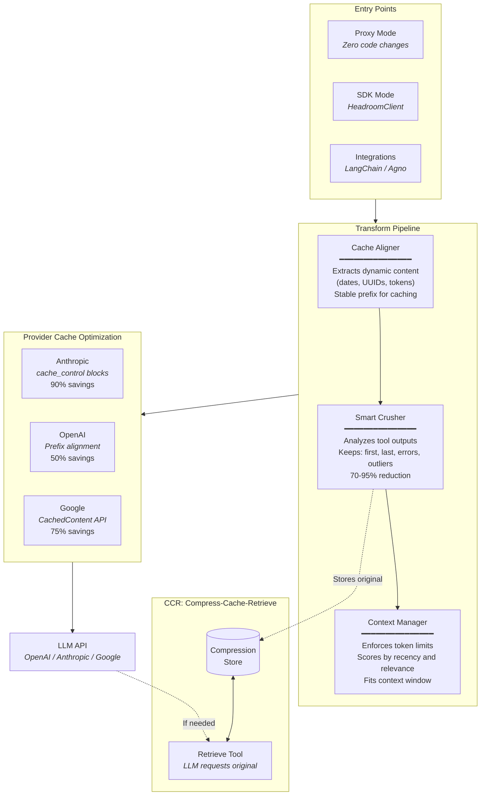

# Headroom SDK: A Complete Explanation

## Architecture Overview



---

## What Problem Does Headroom Solve?

When you use AI models like GPT-4 or Claude, you pay for **tokens** - the pieces of text you send (input) and receive (output). The problem is:

1. **Tool outputs are HUGE**: When an AI agent calls tools (search, database queries, APIs), the responses are often massive JSON blobs with thousands of tokens
2. **Most of that data is REDUNDANT**: 60 metric data points showing `cpu: 45%` repeated, or 50 log entries with the same error message
3. **You're paying for waste**: Every token costs money and adds latency
4. **Context windows fill up**: Models have limits (128K tokens), and bloated tool outputs eat into your available space

**Headroom creates "headroom"** - it intelligently compresses your input tokens so you have more room (and budget) for what matters.

---

## How Headroom Works: The Big Picture

```
┌─────────────────────────────────────────────────────────────────┐
│                        YOUR APPLICATION                          │
└─────────────────────────────────────────────────────────────────┘
                               │
                               ▼
┌─────────────────────────────────────────────────────────────────┐
│                      HEADROOM CLIENT                             │
│  ┌─────────────┐  ┌─────────────┐  ┌─────────────┐             │
│  │   ANALYZE   │→ │  TRANSFORM  │→ │    CALL     │             │
│  │  (Parser)   │  │  (Pipeline) │  │   (API)     │             │
│  └─────────────┘  └─────────────┘  └─────────────┘             │
│         │                │                │                     │
│         ▼                ▼                ▼                     │
│   Count tokens     Apply compressions   Send to OpenAI/Claude  │
│   Detect waste     Preserve meaning     Log metrics            │
└─────────────────────────────────────────────────────────────────┘
                               │
                               ▼
┌─────────────────────────────────────────────────────────────────┐
│                    OPENAI / ANTHROPIC API                        │
└─────────────────────────────────────────────────────────────────┘
```

---

## The Core Components (In Simple Terms)

### 1. HeadroomClient (`client.py`) - The Wrapper

This is what you interact with. It wraps your existing OpenAI or Anthropic client:

```python
# Before (normal OpenAI)
client = OpenAI(api_key="...")
response = client.chat.completions.create(model="gpt-4o", messages=[...])

# After (with Headroom)
base = OpenAI(api_key="...")
client = HeadroomClient(original_client=base, provider=OpenAIProvider())
response = client.chat.completions.create(model="gpt-4o", messages=[...])
```

**What it does:**
- Intercepts your API calls
- Runs messages through the transform pipeline
- Calls the real API with optimized messages
- Logs metrics to a database
- Returns the response unchanged

**Two modes:**
- `audit`: Just observe and log (no changes)
- `optimize`: Apply transforms to reduce tokens

---

### 2. Providers (`providers/`) - Model-Specific Knowledge

Different AI providers have different rules:

```python
class OpenAIProvider:
    # Knows GPT-4o has 128K context
    # Knows how to count tokens (tiktoken)
    # Knows pricing ($2.50 per million input tokens)

class AnthropicProvider:
    # Knows Claude has 200K context
    # Uses different tokenization (~4 chars per token)
    # Different pricing structure
```

**Why this matters:** Token counting is model-specific. GPT-4 uses different tokenization than Claude. Headroom needs accurate counts to know how much to compress.

---

### 3. Parser (`parser.py`) - Understanding Your Messages

Before optimizing, Headroom needs to understand what's in your messages:

```python
messages = [
    {"role": "system", "content": "You are helpful..."},
    {"role": "user", "content": "Search for X"},
    {"role": "assistant", "tool_calls": [...]},
    {"role": "tool", "content": "{huge JSON}"},
]

# Parser breaks this into "blocks":
blocks = [
    Block(kind="system", tokens=50, ...),
    Block(kind="user", tokens=10, ...),
    Block(kind="tool_call", tokens=20, ...),
    Block(kind="tool_result", tokens=5000, ...),  # ← This is the problem!
]
```

**It also detects waste signals:**
- Large JSON blobs (>500 tokens)
- HTML tags and comments
- Base64 encoded data
- Excessive whitespace

---

### 4. Transforms (`transforms/`) - The Compression Magic

This is where the real work happens. Headroom has 4 transforms that run in sequence:

#### Transform 1: Cache Aligner

**Problem:** LLM providers cache your prompts, but only if they're byte-identical. If your system prompt has today's date, every day is a cache miss.

```python
# Before:
"You are helpful. Current Date: 2024-12-15"  # Changes daily = no cache

# After:
"You are helpful."  # Static = cacheable
"[Context: Current Date: 2024-12-15]"  # Dynamic part moved to end
```

**How it works:**
1. Find date patterns in system prompt
2. Extract them
3. Move to end of message
4. Now the PREFIX is stable → cache hits!

---

#### Transform 2: Tool Crusher (Naive) - DISABLED BY DEFAULT

This was our first approach - simple but limited:

```python
# Before: 60 items
[{"ts": 1, "cpu": 45}, {"ts": 2, "cpu": 45}, ..., {"ts": 60, "cpu": 95}]

# After: First 10 items only
[{"ts": 1, "cpu": 45}, ..., {"ts": 10, "cpu": 45}, {"__truncated": 50}]
```

**Problem:** If the important data (CPU spike) is at position 45, it gets thrown away!

---

#### Transform 3: Smart Crusher (NEW DEFAULT)

This is the intelligent approach using **statistical analysis**:

```python
# Analyzes the data first:
analysis = {
    "ts": {"type": "sequential", "unique_ratio": 1.0},
    "host": {"type": "constant", "value": "prod-1"},  # ← Same everywhere!
    "cpu": {"variance": 892, "change_points": [45]},  # ← Spike detected!
}

# Smart compression:
{
    "__headroom_constants": {"host": "prod-1"},  # Factor out
    "__headroom_summary": "items 0-44: cpu stable at ~45",  # Summarize boring part
    "data": [
        {"ts": 45, "cpu": 92},  # Keep the spike!
        {"ts": 46, "cpu": 95},
        ...
    ]
}
```

**Strategies it uses:**
1. **TIME_SERIES**: Detect variance spikes, keep change points
2. **CLUSTER**: Group similar log messages, keep 1-2 per cluster
3. **TOP_N**: For search results, keep highest scored
4. **SMART_SAMPLE**: Statistical sampling with constant extraction

---

#### Transform 4: LLMLingua Compressor (Optional)

**When to use:** Maximum compression needed and latency is acceptable.

```python
# Opt-in ML-based compression using Microsoft's LLMLingua-2
# BERT-based token classifier trained via GPT-4 distillation

# Before: Long tool output text
"The function processUserData takes a user object and validates all fields..."

# After: Compressed while preserving semantic meaning
"function processUserData validates user fields..."
```

**Key characteristics:**
- Uses `microsoft/llmlingua-2-xlm-roberta-large-meetingbank` model
- Auto-detects content type (code, JSON, text) for optimal compression rates
- Stores original in CCR for retrieval if needed
- Adds 50-200ms latency per request
- Requires ~1GB RAM when loaded

**Proxy integration (opt-in):**
```bash
headroom proxy --llmlingua --llmlingua-device cuda
```

---

#### Transform 5: Rolling Window

**Problem:** Even after compression, you might exceed the model's context limit.

```python
# Model limit: 128K tokens
# Your messages: 150K tokens
# Need to drop 22K tokens

# Rolling Window drops OLDEST messages first:
# - Keeps system prompt (always)
# - Keeps last 2 turns (always)
# - Drops old tool calls + their responses as atomic units
```

**Safety rule:** If we drop a tool CALL, we MUST drop its RESPONSE too (or vice versa). Otherwise the model sees orphaned data.

---

#### Transform 6: Intelligent Context Manager (Advanced)

**Problem:** Rolling Window drops by position (oldest first), but position doesn't equal importance.

```python
# Scenario: Error at turn 3, verbose success at turn 10
# Rolling Window: Drops turn 3 error (oldest first)
# Intelligent Context: Keeps turn 3 error (high TOIN error score)
```

**The Solution:** Multi-factor importance scoring using TOIN-learned patterns:

```python
# Message scores (all learned, no hardcodes):
scores = {
    "recency": 0.20,           # Exponential decay from end
    "semantic_similarity": 0.20,  # Embedding similarity to recent context
    "toin_importance": 0.25,   # TOIN retrieval_rate (high = important)
    "error_indicator": 0.15,   # TOIN field_semantics.inferred_type
    "forward_reference": 0.15, # Referenced by later messages
    "token_density": 0.05,     # Unique tokens / total tokens
}

# Drops lowest-scored messages first
# Preserves critical errors even if old
```

**Key principle:** No hardcoded patterns. Error detection uses TOIN's learned `field_semantics.inferred_type == "error_indicator"`, not keyword matching like "error" or "fail".

---

### 5. Storage (`storage/`) - Metrics Database

Every request is logged:

```sql
CREATE TABLE requests (
    id TEXT PRIMARY KEY,
    timestamp TEXT,
    model TEXT,
    mode TEXT,  -- audit or optimize
    tokens_input_before INTEGER,  -- Before Headroom
    tokens_input_after INTEGER,   -- After Headroom
    tokens_saved INTEGER,         -- The win!
    transforms_applied TEXT,      -- What we did
    ...
);
```

This lets you:
- See how much you're saving
- Generate reports
- Track trends over time

---

## The Data Flow (Step by Step)

Let's trace a real request:

### Step 1: You call the API
```python
response = client.chat.completions.create(
    model="gpt-4o",
    messages=[
        {"role": "system", "content": "You are an SRE. Date: 2024-12-15"},
        {"role": "user", "content": "Check the metrics"},
        {"role": "assistant", "tool_calls": [...]},
        {"role": "tool", "content": "{60 metric points...}"},  # 5000 tokens!
        {"role": "user", "content": "What's wrong?"},
    ],
    headroom_mode="optimize",
)
```

### Step 2: HeadroomClient intercepts
```python
# In client.py:
def _create(self, messages, ...):
    # 1. Parse messages into blocks
    blocks, breakdown, waste = parse_messages(messages, tokenizer)
    # breakdown = {"system": 50, "user": 20, "tool_result": 5000, ...}

    # 2. Count original tokens
    tokens_before = 5100
```

### Step 3: Transform Pipeline runs
```python
# In pipeline.py:
def apply(self, messages, ...):
    # Transform 1: Cache Aligner
    # - Extracts "Date: 2024-12-15" from system prompt
    # - Moves to end

    # Transform 2: Smart Crusher
    # - Analyzes 60 metric points
    # - Detects CPU spike at point 45
    # - Compresses to 17 points (preserving spike)
    # - Factors out constant "host" field

    # Transform 3: LLMLingua (if enabled via --llmlingua)
    # - ML-based compression on remaining long text
    # - Auto-detects content type for optimal rate
    # - Stores original in CCR for retrieval

    # Transform 4: Rolling Window
    # - Checks if we're under limit (we are)
    # - No drops needed

    return TransformResult(
        messages=optimized,
        tokens_before=5100,
        tokens_after=1200,  # 76% reduction!
        transforms=["cache_align", "smart_crush:1"]
    )
```

### Step 4: Call real API
```python
# In client.py:
response = self._original.chat.completions.create(
    model="gpt-4o",
    messages=optimized_messages,  # Only 1200 tokens now!
)
```

### Step 5: Log metrics and return
```python
# Save to database
metrics = RequestMetrics(
    tokens_input_before=5100,
    tokens_input_after=1200,
    tokens_saved=3900,  # 76%!
    ...
)
storage.save(metrics)

return response  # Unchanged from API
```

---

## The Smart Crusher Deep Dive

This is the most sophisticated part. Here's how it analyzes data:

### Field Analysis
```python
def analyze_field(key, items):
    values = [item[key] for item in items]

    return {
        "unique_ratio": len(set(values)) / len(values),
        # 0.0 = all same (constant)
        # 1.0 = all different (unique IDs)

        "variance": statistics.variance(values),  # For numbers
        # Low = stable
        # High = changing

        "change_points": detect_spikes(values),
        # Indices where value jumps significantly
    }
```

### Pattern Detection
```python
def detect_pattern(field_stats):
    # Has timestamp + numeric variance? → TIME_SERIES
    if has_timestamp and has_numeric_variance:
        return "time_series"

    # Has message field + level field? → LOGS
    if has_message_field and has_level_field:
        return "logs"

    # Has score/rank field? → SEARCH_RESULTS
    if has_score_field:
        return "search_results"

    return "generic"
```

### Compression Strategy
```python
def compress(items, analysis):
    if analysis.pattern == "time_series":
        # Keep points around change points
        # Summarize stable regions
        return time_series_compress(items, analysis.change_points)

    elif analysis.pattern == "logs":
        # Cluster similar messages
        # Keep 1-2 per cluster
        return cluster_compress(items, analysis.clusters)

    elif analysis.pattern == "search_results":
        # Sort by score
        # Keep top N
        return top_n_compress(items, analysis.score_field)
```

---

## CCR Architecture: Compress-Cache-Retrieve

### The Key Insight

> "Prefer raw > Compaction > Summarization only when compaction no longer yields enough space. Compaction (Reversible) strips out information that is redundant because it exists in the environment—if the agent needs to read the data later, it can use a tool to retrieve it." — Phil Schmid, Context Engineering

**The problem with traditional compression:** If we guess wrong about what's important, we've permanently lost data. The LLM might need something we threw away.

**CCR's solution:** Make compression **reversible**. When SmartCrusher compresses, the original data is cached. If the LLM needs more, it can retrieve instantly.

```
┌──────────────────────────────────────────────────────────────────┐
│  TOOL OUTPUT (1000 items)                                         │
└────────────────────────┬─────────────────────────────────────────┘
                         │
                         ▼
┌──────────────────────────────────────────────────────────────────┐
│  HEADROOM CCR LAYER                                               │
│                                                                   │
│  1. COMPRESS: Keep 20 items (errors, anomalies, relevant)        │
│  2. CACHE: Store full 1000 items in fast local cache             │
│  3. INJECT: Add retrieval capability to LLM context              │
│                                                                   │
│  "20 items shown. Use /v1/retrieve?hash=xxx for more."           │
└────────────────────────┬─────────────────────────────────────────┘
                         │
                         ▼
┌──────────────────────────────────────────────────────────────────┐
│  LLM PROCESSING                                                   │
│                                                                   │
│  Option A: LLM solves task with 20 items → Done                  │
│  Option B: LLM needs more → retrieves via API                    │
│            → We fetch from cache → Return instantly              │
└────────────────────────┬─────────────────────────────────────────┘
                         │
                         ▼
┌──────────────────────────────────────────────────────────────────┐
│  FEEDBACK LOOP                                                    │
│                                                                   │
│  Track: What did the LLM retrieve? What queries?                 │
│  Learn: "For this tool, keep items matching common queries"      │
│  Improve: Next compression uses learned patterns                 │
└──────────────────────────────────────────────────────────────────┘
```

---

### CCR Phase 1: Compression Store

**Location:** `headroom/cache/compression_store.py`

When SmartCrusher compresses, the original content is stored for on-demand retrieval:

```python
@dataclass
class CompressionEntry:
    hash: str                    # 16-char SHA256 for retrieval
    original_content: str        # Full JSON before compression
    compressed_content: str      # Compressed JSON
    original_item_count: int
    compressed_item_count: int
    tool_name: str | None        # For feedback tracking
    created_at: float
    ttl: int = 300               # 5 minute default
```

**Features:**
- Thread-safe in-memory storage
- TTL-based expiration (default 5 minutes)
- LRU-style eviction when capacity reached
- Built-in BM25 search within cached content

**Usage:**
```python
store = get_compression_store()

# Store compressed content
hash_key = store.store(
    original=original_json,
    compressed=compressed_json,
    original_item_count=1000,
    compressed_item_count=20,
    tool_name="search_api",
)

# Retrieve later
entry = store.retrieve(hash_key)

# Or search within cached content
results = store.search(hash_key, "user query")
```

---

### CCR Phase 2: Retrieval API

**Endpoints:**

| Endpoint | Method | Description |
|----------|--------|-------------|
| `/v1/retrieve` | POST | Retrieve original content by hash |
| `/v1/retrieve?query=X` | POST | Search within cached content |

**Retrieval Request:**
```json
{
    "hash": "abc123def456...",
    "query": "find errors"     // Optional: search within
}
```

**Response (full retrieval):**
```json
{
    "hash": "abc123def456...",
    "original_content": "[{...}, {...}, ...]",
    "original_item_count": 1000,
    "tool_name": "search_api"
}
```

**Response (search):**
```json
{
    "hash": "abc123def456...",
    "query": "find errors",
    "results": [{...}, {...}, ...],
    "count": 15
}
```

---

### CCR Phase 3: Tool Injection

When compression happens, Headroom injects retrieval instructions into the LLM context.

**Method A: System Message Injection**
```
## Compressed Context Available
The following tool outputs have been compressed. If you need more detail,
call the retrieve_compressed tool with the hash.

Available: hash=abc123 (1000→20 items from search_api)
```

**Method B: MCP Tool Registration (Hybrid)**
When running as MCP server, Headroom exposes retrieval as a tool:

```json
{
    "name": "headroom_retrieve",
    "description": "Retrieve more items from compressed tool output",
    "inputSchema": {
        "type": "object",
        "properties": {
            "hash": {"type": "string"},
            "query": {"type": "string"}
        }
    }
}
```

**Marker Injection:**
Compressed content includes retrieval markers:
```json
{
    "__headroom_compressed": true,
    "__headroom_hash": "abc123def456",
    "__headroom_stats": {
        "original_items": 1000,
        "kept_items": 20,
        "errors_preserved": 5
    },
    "data": [...]
}
```

---

### CCR Phase 4: Feedback Loop

**Location:** `headroom/cache/compression_feedback.py`

The feedback system learns from retrieval patterns to improve future compression.

**Tracked Patterns per Tool:**
```python
@dataclass
class ToolPattern:
    tool_name: str
    total_compressions: int      # Times we compressed this tool
    total_retrievals: int        # Times LLM asked for more
    full_retrievals: int         # Retrieved everything
    search_retrievals: int       # Used search query
    common_queries: dict[str, int]   # Query frequency
    queried_fields: dict[str, int]   # Fields mentioned in queries
```

**Key Metrics:**
- **Retrieval Rate**: `total_retrievals / total_compressions`
  - High (>50%) → Compressing too aggressively
  - Low (<20%) → Compression is effective
- **Full Retrieval Rate**: `full_retrievals / total_retrievals`
  - High (>80%) → Data is unique, consider skipping compression

**Compression Hints:**
```python
@dataclass
class CompressionHints:
    max_items: int = 15          # Target item count
    suggested_items: int | None  # Calculated optimal
    skip_compression: bool       # Don't compress at all
    preserve_fields: list[str]   # Always keep these fields
    aggressiveness: float        # 0.0 = aggressive, 1.0 = conservative
    reason: str                  # Explanation
```

**Feedback-Driven Adjustment:**
```python
# In SmartCrusher._crush_array()
if self.config.use_feedback_hints and tool_name:
    feedback = get_compression_feedback()
    hints = feedback.get_compression_hints(tool_name)

    if hints.skip_compression:
        return items, f"skip:feedback({hints.reason})", None

    if hints.suggested_items is not None:
        self.config.max_items_after_crush = hints.suggested_items
```

**Feedback Endpoints:**

| Endpoint | Method | Description |
|----------|--------|-------------|
| `/v1/feedback` | GET | Get all learned patterns |
| `/v1/feedback/{tool_name}` | GET | Get hints for specific tool |

**Example Response:**
```json
{
    "total_compressions": 150,
    "total_retrievals": 23,
    "global_retrieval_rate": 0.15,
    "tools_tracked": 5,
    "tool_patterns": {
        "search_api": {
            "compressions": 50,
            "retrievals": 5,
            "retrieval_rate": 0.10,
            "full_rate": 0.20,
            "search_rate": 0.80,
            "common_queries": ["status:error", "level:critical"],
            "queried_fields": ["status", "level", "message"]
        }
    }
}
```

---

### CCR Phase 5: Response Handler (Automatic Tool Call Handling)

**Location:** `headroom/ccr/response_handler.py`

**The Problem:** When the proxy injects the `headroom_retrieve` tool, the LLM might call it. But who handles that tool call? Without response handling, the tool call would go back to the client unhandled.

**The Solution:** The Response Handler intercepts LLM responses, detects CCR tool calls, executes retrievals automatically, and continues the conversation until the LLM produces a final response.

```
┌──────────────────────────────────────────────────────────────────┐
│  RESPONSE HANDLER FLOW                                           │
│                                                                   │
│  1. LLM Response arrives                                         │
│     └─ Contains: tool_use(headroom_retrieve, hash=abc123)       │
│                                                                   │
│  2. Handler detects CCR tool call                                │
│     └─ Extracts hash and optional query                         │
│                                                                   │
│  3. Handler executes retrieval                                   │
│     └─ Full retrieval: store.retrieve(hash)                     │
│     └─ Search: store.search(hash, query)                        │
│                                                                   │
│  4. Handler continues conversation                               │
│     └─ Adds tool result to messages                             │
│     └─ Makes another API call                                   │
│                                                                   │
│  5. Repeat until no CCR tool calls                              │
│     └─ Max 3 rounds (configurable)                              │
│                                                                   │
│  6. Return final response to client                             │
└──────────────────────────────────────────────────────────────────┘
```

**Key Classes:**

```python
@dataclass
class CCRToolCall:
    tool_call_id: str      # For matching response
    hash_key: str          # CCR hash to retrieve
    query: str | None      # Optional search query

@dataclass
class CCRToolResult:
    tool_call_id: str
    content: str           # Retrieved data as JSON
    success: bool
    items_retrieved: int
    was_search: bool       # True if search, False if full retrieval

class CCRResponseHandler:
    async def handle_response(
        self,
        response: dict,           # Initial LLM response
        messages: list,           # Conversation history
        tools: list,              # Tool definitions
        api_call_fn: Callable,    # Function to make API calls
        provider: str,            # "anthropic" or "openai"
    ) -> dict:
        """Handle CCR tool calls until final response."""
```

**Streaming Support:**

The handler also supports streaming responses via `StreamingCCRHandler`:

```python
class StreamingCCRBuffer:
    """Buffers streaming chunks to detect CCR tool calls."""
    chunks: list[bytes]
    detected_ccr: bool

class StreamingCCRHandler:
    """Handles CCR in streaming responses."""
    async def process_stream(self, stream, messages, tools, api_call_fn):
        """Yields chunks, switching to buffered mode if CCR detected."""
```

---

### CCR Phase 6: Context Tracker (Multi-Turn Awareness)

**Location:** `headroom/ccr/context_tracker.py`

**The Problem:** In multi-turn conversations, earlier compressed data might become relevant later. Without tracking, the LLM has "context amnesia" - it can't reference data that was compressed in turn 1 when answering a question in turn 5.

**The Solution:** The Context Tracker maintains awareness of all compressed content across the conversation and can proactively expand relevant data when a new query might need it.

```
┌──────────────────────────────────────────────────────────────────┐
│  CONTEXT TRACKER FLOW                                            │
│                                                                   │
│  Turn 1: Search returns 100 files → compressed to 10            │
│          Tracker stores: hash=abc123, sample="auth.py, db.py"   │
│                                                                   │
│  Turn 5: User asks "What about the authentication middleware?"  │
│          Tracker analyzes query:                                 │
│          - "authentication" matches "auth.py" in sample         │
│          - Relevance score: 0.7 (above threshold)               │
│                                                                   │
│  Proactive Expansion:                                           │
│          - Retrieves abc123 before LLM responds                 │
│          - Adds expanded context to request                     │
│                                                                   │
│  Result: LLM sees full file list, can answer accurately         │
└──────────────────────────────────────────────────────────────────┘
```

**Key Classes:**

```python
@dataclass
class CompressedContext:
    hash_key: str              # CCR hash
    turn_number: int           # When compression happened
    timestamp: float           # For age-based filtering
    tool_name: str | None      # Which tool was compressed
    original_item_count: int
    compressed_item_count: int
    query_context: str         # User query at compression time
    sample_content: str        # Preview for relevance matching

@dataclass
class ExpansionRecommendation:
    hash_key: str
    reason: str                # Human-readable explanation
    relevance_score: float     # 0-1, higher = more relevant
    expand_full: bool          # True = full retrieval
    search_query: str | None   # If expand_full=False

class ContextTracker:
    def track_compression(self, hash_key, turn_number, ...):
        """Track a compression event."""

    def analyze_query(self, query: str) -> list[ExpansionRecommendation]:
        """Find relevant compressed contexts for a query."""

    def execute_expansions(self, recommendations) -> list[dict]:
        """Execute recommended expansions."""
```

**Relevance Calculation:**

The tracker uses simple but effective heuristics:

1. **Keyword overlap with sample content** - Extract keywords from query, match against compressed content preview
2. **Keyword overlap with original query** - Match against the query that triggered compression
3. **Tool name relevance** - File operations more likely to need expansion for "file", "where", "find" queries
4. **Age discount** - Older contexts get lower scores

**Configuration:**

```python
@dataclass
class ContextTrackerConfig:
    enabled: bool = True
    max_tracked_contexts: int = 100      # LRU eviction
    relevance_threshold: float = 0.3     # Min score to recommend
    max_context_age_seconds: float = 300 # 5 minutes
    proactive_expansion: bool = True
    max_proactive_expansions: int = 2    # Per query
```

---

### Why CCR is a Moat

1. **Reversible**: No permanent information loss. Worst case = retrieve everything.
2. **Transparent**: LLM knows it can ask for more data.
3. **Automatic**: Response Handler executes retrievals without client intervention.
4. **Context-Aware**: Context Tracker prevents multi-turn amnesia.
5. **Feedback Loop**: Learn from actual needs, not guesses.
6. **Network Effect**: Retrieval patterns across users improve compression for everyone.
7. **Zero-Risk**: If compression fails, instant fallback to original data.

---

## File Structure Explained

```
headroom/
├── __init__.py          # Public exports
├── client.py            # HeadroomClient - the main wrapper
├── config.py            # All configuration dataclasses
├── parser.py            # Message → Block decomposition
├── tokenizer.py         # Token counting abstraction
├── utils.py             # Hashing, markers, helpers
│
├── providers/
│   ├── base.py          # Provider/TokenCounter protocols
│   ├── openai.py        # OpenAI-specific (tiktoken)
│   └── anthropic.py     # Anthropic-specific
│
├── transforms/
│   ├── base.py              # Transform protocol
│   ├── pipeline.py          # Orchestrates all transforms
│   ├── cache_aligner.py     # Date extraction for caching
│   ├── tool_crusher.py      # Naive compression (disabled)
│   ├── smart_crusher.py     # Statistical compression (default)
│   ├── rolling_window.py    # Token limit enforcement (position-based)
│   ├── intelligent_context.py  # Semantic context management (score-based)
│   ├── scoring.py           # Message importance scoring
│   └── llmlingua_compressor.py  # ML-based compression (opt-in)
│
├── cache/               # CCR Architecture - Caching & Storage
│   ├── compression_store.py    # Phase 1: Store original content
│   ├── compression_feedback.py # Phase 4: Learn from retrievals
│   ├── anthropic.py     # Anthropic cache optimizer
│   ├── openai.py        # OpenAI cache optimizer
│   ├── google.py        # Google cache optimizer
│   └── dynamic_detector.py # Dynamic content detection
│
├── ccr/                 # CCR Architecture - Tool Injection & Response Handling
│   ├── __init__.py             # CCR module exports
│   ├── tool_injection.py       # Phase 3: Inject retrieval tool
│   ├── response_handler.py     # Phase 5: Handle CCR tool calls
│   ├── context_tracker.py      # Phase 6: Multi-turn context tracking
│   └── mcp_server.py           # MCP server for retrieval tool
│
├── relevance/           # Relevance scoring for compression
│   ├── bm25.py          # BM25 keyword scorer
│   ├── embedding.py     # Semantic embedding scorer
│   └── hybrid.py        # Adaptive fusion scorer
│
├── storage/
│   ├── base.py          # Storage protocol
│   ├── sqlite.py        # SQLite implementation
│   └── jsonl.py         # JSON Lines implementation
│
├── proxy/
│   └── server.py        # Production HTTP proxy (CCR endpoints)
│
└── reporting/
    └── generator.py     # HTML report generation
```

---

## Key Design Decisions

### 1. Provider-Agnostic
Works with ANY OpenAI-compatible API:
- OpenAI
- Azure OpenAI
- Anthropic
- Groq
- Together
- Local models (Ollama)

### 2. Deterministic Transforms
No LLM calls for compression. Everything is:
- Statistical analysis
- Pattern matching
- Rule-based

This means:
- Predictable results
- Fast (<10ms overhead)
- No added API costs

### 3. Safety First
- Never modify user/assistant TEXT content
- Tool call + response are atomic (drop both or neither)
- Parse failures = no-op (return unchanged)
- Audit mode for testing before optimizing

### 4. Smart by Default
- SmartCrusher enabled (statistical analysis)
- ToolCrusher disabled (naive rules)
- Conservative settings that preserve important data

---

## What Makes This Different?

### vs. Summarization (LLM-based compression)
| Headroom | Summarization |
|----------|---------------|
| Deterministic | Non-deterministic |
| ~10ms overhead | ~2-5 seconds overhead |
| No extra API cost | Costs money to summarize |
| Preserves structure | Loses structure |
| Can't hallucinate | Can hallucinate |

### vs. Simple Truncation
| Headroom | Truncation |
|----------|------------|
| Keeps important data | Loses end of data |
| Statistical analysis | No analysis |
| Detects spikes | Misses spikes |
| Factors out constants | Keeps redundancy |

---

## The Numbers (From Our Tests)

Real-world SRE incident investigation:
- **5 tool calls**: Metrics, logs, status, deployments, runbook
- **Original**: 22,048 tokens
- **After SmartCrusher**: 2,190 tokens
- **Reduction**: 90%
- **Quality Score**: 5.0/5 (no information loss)

The model could still:
- Identify the CPU spike (preserved by change point detection)
- Reference specific error rates (kept in compressed data)
- Provide correct remediation commands

---

## Summary

**Headroom is a Context Budget Controller that:**

1. **Wraps** your existing LLM client
2. **Analyzes** your messages to find waste
3. **Compresses** tool outputs intelligently (not blindly)
4. **Preserves** important information (spikes, anomalies, unique data)
5. **Logs** everything for observability
6. **Saves** 70-90% of tokens on tool-heavy workloads

**The key insight:** Most tool output redundancy is **statistical** (repeated values, constant fields, similar messages). By analyzing the data first, we can compress intelligently without losing the information that matters.
